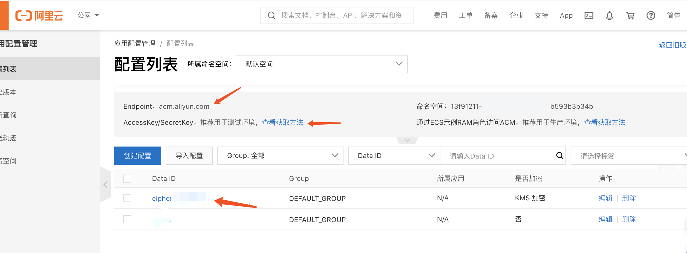

# ali-config

使用阿里云ACM作为配置中心
> `https://help.aliyun.com/document_detail/59956.html`

基于官方提供的`go-sdk`
> `https://github.com/nacos-group/nacos-sdk-go`

#### 无加密版
1. 现在阿里云上创建对应的资源


2. 将对应的资源配置写到环境变量中
```shell
$ export ali_config_endpoint=""
$ export ali_config_namespace_id=""
$ export ali_config_access_key=""
$ export ali_config_secret_key=""
$ export ali_config_data_id=""
$ export ali_config_group=""
```


